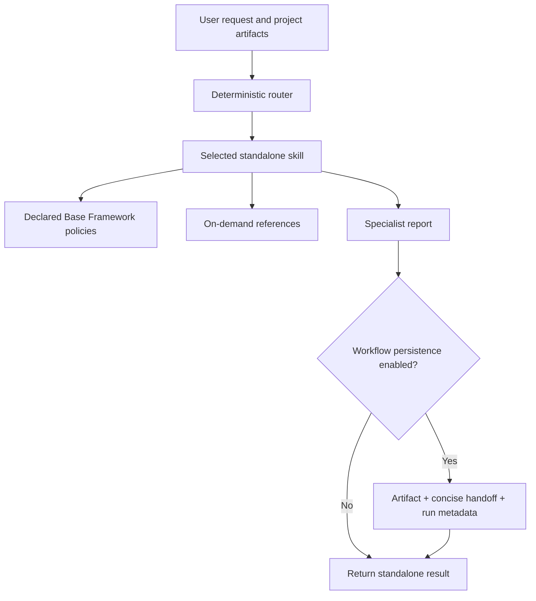

# Repository Architecture

## Design goals

The collection is designed to be independently installable, evidence-based, safe around untrusted repository content, and practical in tool-rich or tool-less environments. A skill owns one primary deliverable; adjacent work is routed rather than silently absorbed.

## Package model

Each `skills/<lowercase-kebab-case>/` folder is a standalone package. `SKILL.md` is the canonical instruction file. Its optional references, examples, evaluations, and assets stay inside the owning folder so installation does not create hidden cross-skill dependencies.



## Base Framework and shared policies

`shared/base/` is the canonical, versioned Base Framework. It provides policies for evidence, scope/routing, security/redaction, untrusted content, safe command execution, workflow integration, actionable output, partial results, quality gates, and context budgets.

`shared/base/skill-policy-map.json` declares the policy subset for each skill. `python scripts/sync_base_framework.py` packages that subset into `skills/<skill>/shared/base/`; `python scripts/validate_framework.py` rejects drift or incompatible declarations. The policy precedence is system/platform instructions, user request, skill instructions, Base Framework policies, then repository and third-party artifacts as evidence.

## Routing and context management

`shared/skill-router.json` records each skill's intended deliverable, activation signals, exclusions, closest skills, precedence, and examples. `scripts/skill_router.py` emits one primary skill with explanations and optional material secondaries. The router and its regression cases deliberately route by requested outcome and state—for example, future architecture versus current architecture, active debugging versus post-incident RCA, or review versus implementation.

`BF-CONTEXT-1` requires risk-ranked, phase-relevant loading. Skills do not preload all references; they state coverage and the next smallest evidence request when context is insufficient.

## Workflow contract and persistence

Workflow integration is optional. When a target project requests persistent output or already contains `.ai-workflow/`, a skill may write:

```text
.ai-workflow/
  state.json                 # lightweight run metadata only
  artifacts/<skill-name>.md  # detailed specialist output
  handoffs/<skill-name>.json # concise cross-skill summary
```

The canonical [workflow contract](shared/workflow-contract.md) requires topic-filtered reads, verification of inherited claims, provenance for extended findings, safe failure behavior, and lock-safe state updates. Missing, stale, malformed, or irrelevant handoffs never block standalone work. `scripts/replay_workflow.py` validates persisted state without running artifacts.

## Discovery, schemas, and validation

The `skills/` folders are source of truth. Generated discovery material—[SKILLS.md](SKILLS.md), `shared/skill-catalog.json`, report schemas, reference catalog, and lock data—is checked for drift. Standalone package checks simulate selected skill layouts without network access.

The [Quality System](QUALITY_SYSTEM.md) documents the deterministic layers: static checks, routing, report-schema validation, context accounting, behavioral and composition evaluation, mutation regression, reference freshness, secret redaction, and prompt-injection handling. Optional protected model evaluations are separate from deterministic release gates.

## CI and release flow

Pull requests, `main`, and version tags run the repository's validation and deterministic evaluation suites on Ubuntu and Windows. CI has read-only contents permission, avoids `pull_request_target`, and uploads redacted evaluation results only. The full release workflow and publication settings are documented in [RELEASE.md](RELEASE.md).

## Extension rules

New skills must keep a unique routing boundary, own their references/evaluations, declare only necessary policies and handoff topics, provide routing regression coverage, generate discovery/schema artifacts, and pass standalone packaging checks. See [CONTRIBUTING.md](CONTRIBUTING.md) for the complete definition of done.
