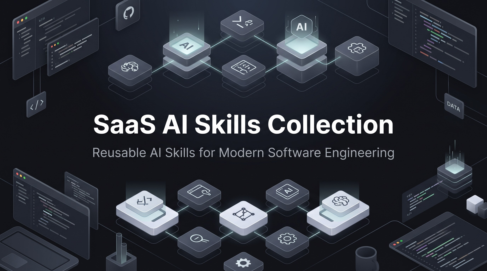

# SaaS AI Skills Collection

[](https://skills.sh/noorkhalel/saas-ai-skills)
[](https://github.com/Noorkhalel/saas-ai-skills/actions/workflows/validate-skills.yml)
[](LICENSE)
[](VERSION)

Independent, portable AI skills for planning, building, reviewing, securing, testing, and operating modern SaaS applications. Each skill provides a focused, evidence-based workflow without requiring a shared runtime or another installed skill.

## Start here

1. Browse the [skill catalog](SKILLS.md) and choose the primary outcome you need.
2. Install the collection, one skill, or a selected set using the [installation guide](INSTALL.md).
3. Give your compatible coding agent the relevant request and project artifacts.
4. Read [FAQ](FAQ.md), [troubleshooting](TROUBLESHOOTING.md), or [support](SUPPORT.md) if you need help.

```bash
# Install the collection
npx skills add noorkhalel/saas-ai-skills

# Install one skill
npx skills add noorkhalel/saas-ai-skills --skill debugging

# Install a focused workflow
npx skills add noorkhalel/saas-ai-skills \
  --skill codebase-understanding \
  --skill security-audit \
  --skill test-generation
```

The folder name is the installation identifier. Check `npx skills add --help` if your installed Skills CLI differs.

## Choose a skill

| If you need to... | Use |
|---|---|
| Understand an unfamiliar repository or trace a feature | [Codebase Understanding](skills/codebase-understanding/SKILL.md) |
| Plan a new system or material future-state change | [Architecture Planning](skills/architecture-planning/SKILL.md) |
| Review current boundaries and modernization options | [Clean Architecture Review](skills/clean-architecture-review/SKILL.md) |
| Review a change or implementation broadly | [Code Review](skills/code-review/SKILL.md) |
| Diagnose an active failure | [Debugging](skills/debugging/SKILL.md) |
| Produce a post-incident systemic analysis | [Root Cause Analysis](skills/root-cause-analysis/SKILL.md) |
| Design an API, schema, tests, or safe refactor | [API Design Review](skills/api-design-review/SKILL.md), [Database Design](skills/database-design/SKILL.md), [Test Generation](skills/test-generation/SKILL.md), or [Refactoring Code](skills/refactoring-code/SKILL.md) |
| Audit security, performance, or dependencies | [Security Audit](skills/security-audit/SKILL.md), [Performance Optimization](skills/performance-optimization/SKILL.md), or [Dependency Analysis](skills/dependency-analysis/SKILL.md) |
| Evaluate SOLID risks or a design-pattern choice | [SOLID Review](skills/solid-review/SKILL.md) or [Design Pattern Advisor](skills/design-pattern-advisor/SKILL.md) |

See [SKILLS.md](SKILLS.md) for all 15 skills, their categories, descriptions, and exact installation identifiers. The [routing matrix](shared/routing-matrix.md) explains close calls.

## What makes these skills dependable

- **Evidence first.** Findings distinguish verified facts, inferences, assumptions, and unknowns.
- **Clear routing.** The requested deliverable selects the skill; adjacent concerns do not automatically expand scope.
- **Safe standalone packaging.** Every installed skill carries the policy subset, references, and optional workflow contract it needs.
- **Context discipline.** References are loaded only when they can change the next decision.
- **Validated behavior.** CI checks routing, generated catalogs, packaged resources, workflow persistence, redaction, prompt-injection resistance, report schemas, and deterministic evaluation fixtures.

Read [Architecture](ARCHITECTURE.md) for the system design and [Quality System](QUALITY_SYSTEM.md) for the validation model.

## Optional cross-skill workflow

Skills remain independent. When a project opts in by creating `.ai-workflow/` or requesting persistent output, they can leave compact, re-verifiable handoffs for later skills:

```text
.ai-workflow/
  state.json                 # lightweight run metadata
  artifacts/<skill-name>.md  # detailed specialist report
  handoffs/<skill-name>.json # concise, topic-filtered summary
```

Handoffs are leads, not facts: the receiving skill verifies important claims in the project before relying on them. Missing or malformed workflow files never block a normal standalone run. See the [workflow contract](shared/workflow-contract.md).

## Compatibility

| Surface | Support statement |
|---|---|
| Skills CLI | Uses repository installation and repeated `--skill <folder>` selectors. Verify your local CLI with `npx skills add --help`. |
| Folder-based loaders | Supported when the loader can read `SKILL.md` and relative package files. |
| Single-rules-file tools | Use `SKILL.md` and inline only the needed relative references. |
| Optional integrations | Git, filesystem, database, browser, observability, and MCP tools improve evidence collection but are never required for the skill to produce a bounded result. |

## Documentation

| Topic | Read |
|---|---|
| Installation and compatibility | [INSTALL.md](INSTALL.md) |
| Catalog and selection | [SKILLS.md](SKILLS.md) and [shared/routing-matrix.md](shared/routing-matrix.md) |
| Architecture, policies, persistence, and handoffs | [ARCHITECTURE.md](ARCHITECTURE.md) |
| Evaluations, validation, and CI | [QUALITY_SYSTEM.md](QUALITY_SYSTEM.md) |
| Contributing and development | [CONTRIBUTING.md](CONTRIBUTING.md) and [DEVELOPMENT.md](DEVELOPMENT.md) |
| Releases and changes | [RELEASE.md](RELEASE.md), [RELEASE_NOTES.md](RELEASE_NOTES.md), and [CHANGELOG.md](CHANGELOG.md) |
| Security and community | [SECURITY.md](SECURITY.md), [SUPPORT.md](SUPPORT.md), and [CODE_OF_CONDUCT.md](CODE_OF_CONDUCT.md) |

## Release status

Version [`1.1.0`](VERSION) introduces the Base Framework, deterministic routing and evaluation layers, standalone packaging checks, optional workflow persistence, and release-quality validation. See [release notes](RELEASE_NOTES.md) for upgrade information and known limitations.

## Contributing and security

Contributions are welcome. Start with [CONTRIBUTING.md](CONTRIBUTING.md), use the provided issue and pull-request templates, and run the documented validation before opening a PR. Please report security concerns through the process in [SECURITY.md](SECURITY.md), not in a public issue.

This project is licensed under the [MIT License](LICENSE).
