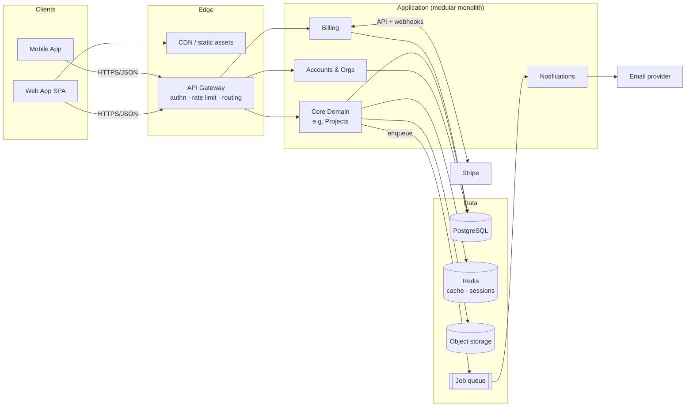
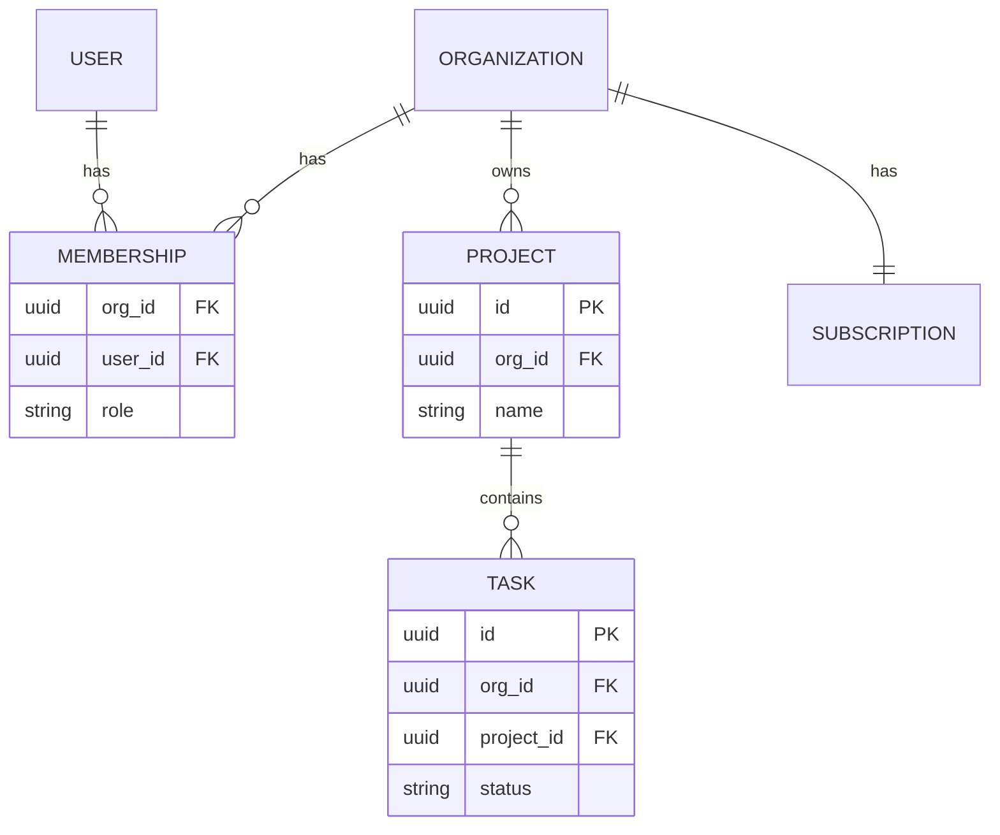
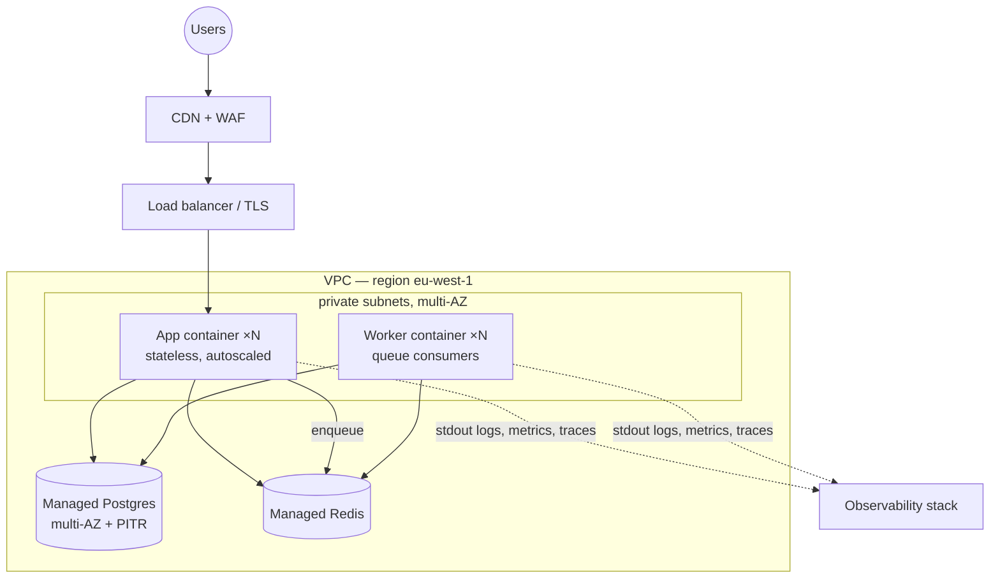

# Mermaid Diagram Patterns

Ready-to-adapt snippets for the four diagram types an architecture plan uses. Rules that keep diagrams useful: **≤ 15 nodes** (split into overview + detail diagrams past that); **label the edges** (what flows, which protocol); **subgraphs = boundaries** (trust boundaries, deployment units, module seams — boundaries are what architecture diagrams exist to show); consistent names with the Component Responsibilities section. If a diagram wouldn't change a reader's understanding, cut it; if a flow needs more than a paragraph of prose, diagram it.

## Component diagram (every full plan)

`flowchart` with subgraphs for boundaries. Show: clients, edge, modules/services, stores, external systems.



Modules inside the subgraph, arrows through the owning module only (never client→DB or module→another module's store) — the diagram should *show* the data-ownership rule holding.

## Sequence diagram (request flow, auth flow)

One per core workflow that involves 3+ participants or a non-obvious ordering. Auth flow example:

```mermaid
sequenceDiagram
    autonumber
    participant B as Browser
    participant GW as API Gateway
    participant A as Auth module
    participant DB as PostgreSQL

    B->>GW: POST /v1/auth/login {email, password}
    GW->>A: forward (rate-limited)
    A->>DB: fetch user by email
    A->>A: verify argon2id hash
    alt MFA enabled
        A-->>B: 200 {mfa_required, challenge_token}
        B->>A: POST /v1/auth/mfa {challenge_token, totp}
    end
    A->>DB: create session
    A-->>B: Set-Cookie: session (HttpOnly, Secure, SameSite)
    Note over B,GW: subsequent requests carry the cookie;<br/>GW resolves session → user + org memberships
```

Use `alt`/`opt` blocks for branches (MFA, cache hit/miss, payment failure) — branch behavior is exactly what prose descriptions get wrong.

## ER diagram (data architecture)

Core entities only (5–10) — the conceptual model, not every column. Include the FK/ownership columns that carry the design (like `tenant_id`/`org_id` everywhere in pooled SaaS):



## Deployment diagram (deployment architecture section)

Runtime topology: regions/AZs, networks, what runs where, what's managed:



Solid arrows = request/data path; dotted = telemetry. Show the multi-AZ/managed-service facts here rather than claiming them only in prose.
