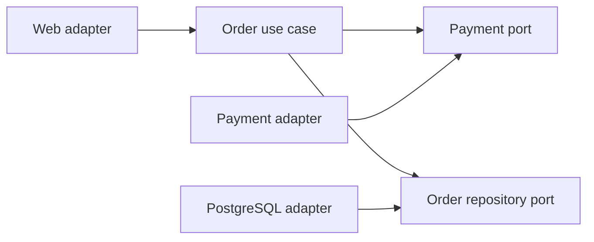

# Architecture styles, boundaries, and domain design

## Pattern identification

Clean/Onion architecture organizes policy inward and adapters/frameworks outward. Hexagonal architecture names the same idea through inbound ports (driving adapters) and outbound ports (driven adapters). Layered/MVC can be healthy if dependencies are controlled. Vertical slices organize by capability; each slice can own its policy/data access without artificial cross-cutting layers. A modular monolith has explicit module boundaries and deploys as one unit. Microservices need independently deployable ownership, not merely HTTP between codebases.

Classify by behavior: imports, DI composition root, database/framework types in policy, contracts, data ownership, deployment/release, and runtime calls. Hybrids are normal. State where a pattern improves the present change pressures and where it adds ceremony.

## Scenario signals

| Context | Review focus |
|---|---|
| React + FastAPI Clean Architecture SaaS | browser/API DTO mapping, use-case policy, ORM/framework isolation, tenant authorization, feature ownership |
| NestJS modular monolith with DDD | module imports/providers, bounded-context contracts, shared kernel/database reach-through, aggregate ownership |
| Legacy MVC or tightly coupled startup codebase | characterization tests, fat controllers, hidden globals, smallest safe seam before any restructure |
| Spring Boot Hexagonal application | ports owned by use cases, adapter/bean wiring, transaction/ORM leakage, contract/integration tests |
| E-commerce microservices | commerce data ownership, synchronous chains, event/idempotency/retry, deployment and on-call coupling |
| Supabase-backed SaaS feature modules | tenant/RLS boundary, database ownership, feature-module contract, Edge Function/client coupling |
| CQRS + event sourcing | projection freshness/rebuild, event version/replay, write-model invariants, recovery operations |
| Large enterprise monolith modernization | strangler seam, co-change/incident evidence, migration governance, incremental extraction economics |
| Production-ready SaaS maintainability | long-term maintainability, ownership, deploy/test reliability, observability, capacity and dependency governance |

## Boundary tests

A boundary has a named owner, cohesive responsibility, public contract, internal implementation freedom, explicit data/invariant ownership, allowed dependencies, and independent test/change path. A port belongs to the use case/domain policy that consumes it; an adapter implements it at the edge. Do not make every dependency an interface: introduce a port for external volatility, cross-boundary policy, test isolation, or meaningful substitution.

Shared code is safe only when it has stable, truly shared semantics and governance. Shared entities, databases, helpers, and catch-all "common" modules often become hidden coupling. Prefer a narrow published contract, duplication of small stable code, or an anti-corruption adapter when bounded contexts differ.

## DDD and transactional design

Use ubiquitous language to find bounded contexts and translation boundaries. Keep aggregates small enough to enforce one immediate invariant transactionally; reference other aggregates by identity, and use asynchronous/domain events for cross-aggregate reactions when eventual consistency is acceptable. Repositories should express aggregate persistence, not expose arbitrary ORM/query APIs. Anemic entities are a problem when behavior/invariants are scattered and inconsistent, not because records have getters.

For CQRS, maintain one authoritative write model, explicit read-model projection owner/freshness/rebuild, and separate optimization rationale. For event sourcing, design event identity/version/schema evolution, replay/snapshot, idempotent consumers, ordering, retention/privacy deletion, observability, and incident recovery. Do not adopt either just to make CRUD look advanced.

## Mermaid component map

Use component maps for verified dependencies and label runtime communication separately. Keep it small enough to review:

The adapter depends on the port; the use case does not import the adapter. This diagram is a claim to verify in imports/DI wiring, not proof by itself.
