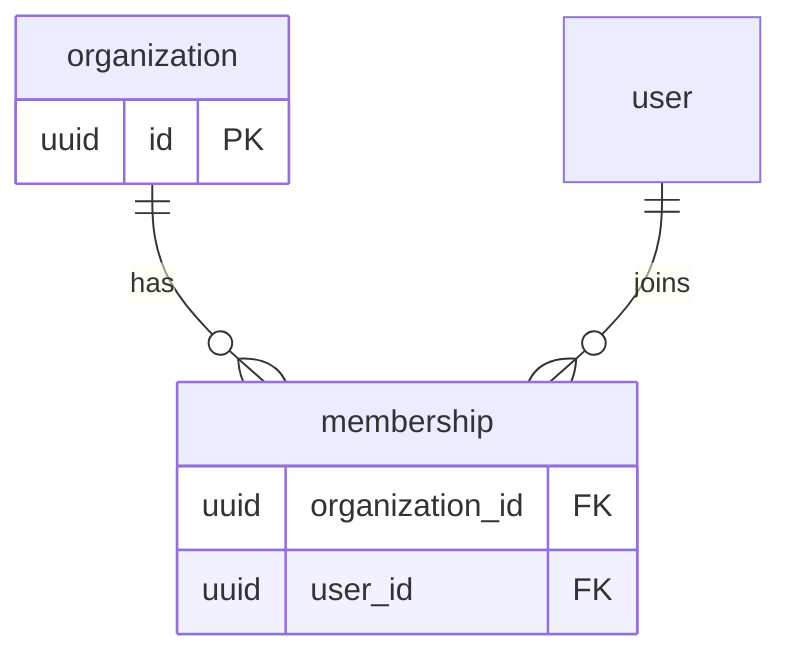

# Architecture and data modeling

## Model from behavior

Start with commands, queries, reports, events, and failure/consistency requirements. Separate entity identity from mutable attributes, value objects, external references, and derived projections. Declare a single source of truth and write model invariants in terms that can be enforced or tested.

Use a transaction boundary around facts that must change atomically. For cross-service side effects, write the domain change and an outbox record in one local transaction; publish idempotently and make consumers idempotent. Do not use a distributed transaction as a default.

## Relationship choices

- One-to-one is often an optional extension table; enforce one row with a unique foreign key.
- One-to-many stores the parent key on the owned child; choose nullability and deletion semantics from lifecycle ownership.
- Many-to-many needs an association table; promote it to a full entity when membership has role, ordering, dates, metadata, history, or permissions.
- Polymorphism needs explicit integrity: a type plus constrained subtype tables, or a validated reference design. Avoid unconstrained `(type, id)` references for core facts because they cannot be foreign-key protected.
- Inheritance should be chosen for concrete query/lifecycle needs, not object-oriented symmetry. Table-per-type can preserve subtype constraints; table-per-hierarchy can simplify reads but needs type-aware checks.

## Mermaid ERD discipline

Use `erDiagram` with physical table names and relationship labels that state the business meaning. List PK/FK columns without inventing nullable values. Use cardinality syntax consistently: `||` exactly one, `o|` zero or one, `}|` one or more, and `o{` zero or more. Keep many-to-many association tables visible. A minimal pattern is:

## Normalization and intentional denormalization

Use 1NF for atomic values/repeating groups, 2NF to remove partial dependencies, 3NF to remove non-key dependencies, and BCNF when a determinant is not a candidate key. Normalize transactional facts by default. Denormalize only with a named read/query/reliability reason, source of truth, writer, freshness target, reconciliation process, and rebuild plan. Candidates include materialized/reporting views, search projections, counters, and immutable snapshots.

## Technology selection guide

| Need | Default fit | Caution |
|---|---|---|
| ACID SaaS, joins, constraints, reporting | PostgreSQL | Scale data model and queries before splitting stores |
| Existing Microsoft estate/BI integration | SQL Server | Version/licensing/operational fit |
| MySQL-aligned ecosystem | MySQL | Verify feature/isolation/index behavior by version |
| Embedded/local data | SQLite | Single-writer/concurrency and operational limits |
| Flexible aggregate documents, predictable document access | MongoDB | Enforce integrity and avoid accidental cross-document joins |
| Key-value cache/ephemeral state | Redis | Not authoritative durable business state by default |
| Search relevance | Elasticsearch | Derived index, mapping/version/rebuild required |
| Vector retrieval | pgvector or managed vector DB | ACL/filtering, recall, deletion, versioning, cost |

## Financial and audit-critical data

Use append-only, immutable ledger/posting facts. Store currency and exact amounts; define rounding and balance invariants. Use idempotency keys for externally retried commands. Correct facts with explicit reversals/adjustments rather than mutation. Keep operational audit logs distinct from the business ledger, protect their access, and define retention/immutability needs with legal/compliance owners.
